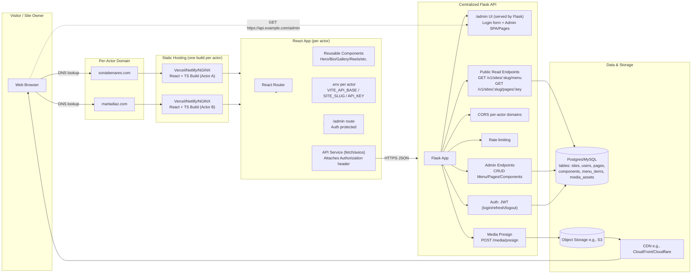

```mermaid
flowchart LR
  subgraph User["Visitor / Site Owner"]
    BROWSER["Web Browser"]
  end

  subgraph DNS["Per-Actor Domain"]
    DNS_A["soniabenares.com"]
    DNS_B["martadiaz.com"]
  end

  subgraph Frontend["Static Hosting (one build per actor)"]
    direction TB
    HOST_A["Vercel/Netlify/NGINX<br/>React + TS Build (Actor A)"]
    HOST_B["Vercel/Netlify/NGINX<br/>React + TS Build (Actor B)"]
  end

  subgraph ReactApp["React App (per actor)"]
    direction TB
    ROUTER["React Router"]
    COMPONENTS["Reusable Components<br/>Hero/Bio/Gallery/Reels/etc."]
    ENV[".env per actor<br/>VITE_API_BASE / SITE_SLUG / API_KEY"]
    ADMIN["/admin route<br/>Auth protected"]
    COMM["API Service (fetch/axios)<br/>Attaches Authorization header"]
  end

  subgraph API["Centralized Flask API"]
    direction TB
    FLASK["Flask App"]
    ADMIN_UI["/admin UI (served by Flask)<br/>Login form + Admin SPA/Pages"]
    AUTH["Auth: JWT (login/refresh/logout)"]
    CORS["CORS per-actor domains"]
    RATE["Rate limiting"]
    ENDPOINTS["Public Read Endpoints<br/>GET /v1/sites/:slug/menu<br/>GET /v1/sites/:slug/pages/:key"]
    ADMIN_API["Admin Endpoints<br/>CRUD Menu/Pages/Components"]
    MEDIA["Media Presign<br/>POST /media/presign"]
  end

  subgraph Persistence["Data & Storage"]
    DB[("Postgres/MySQL<br/>tables: sites, users, pages,<br/>components, menu_items, media_assets")]
    S3[("Object Storage e.g., S3")]
    CDN["CDN e.g., CloudFront/Cloudflare"]
  end

  BROWSER -- "DNS lookup" --> DNS_A
  BROWSER -- "DNS lookup" --> DNS_B

  DNS_A --> HOST_A
  DNS_B --> HOST_B

  HOST_A --> ReactApp
  HOST_B --> ReactApp

  ReactApp --> ROUTER
  ReactApp --> COMPONENTS
  ReactApp --> ENV
  ReactApp --> ADMIN
  ReactApp --> COMM

  COMM -- "HTTPS JSON" --> API

  API --> FLASK
  FLASK --> ADMIN_UI
  FLASK --> AUTH
  FLASK --> CORS
  FLASK --> RATE
  FLASK --> ENDPOINTS
  FLASK --> ADMIN_API
  FLASK --> MEDIA

  ENDPOINTS --> DB
  ADMIN_API --> DB
  AUTH --> DB
  MEDIA --> S3

  S3 --> CDN
  CDN --> BROWSER

  %% Admin access path (served by Flask)
  BROWSER -. "GET https://api.example.com/admin" .-> ADMIN_UI
```