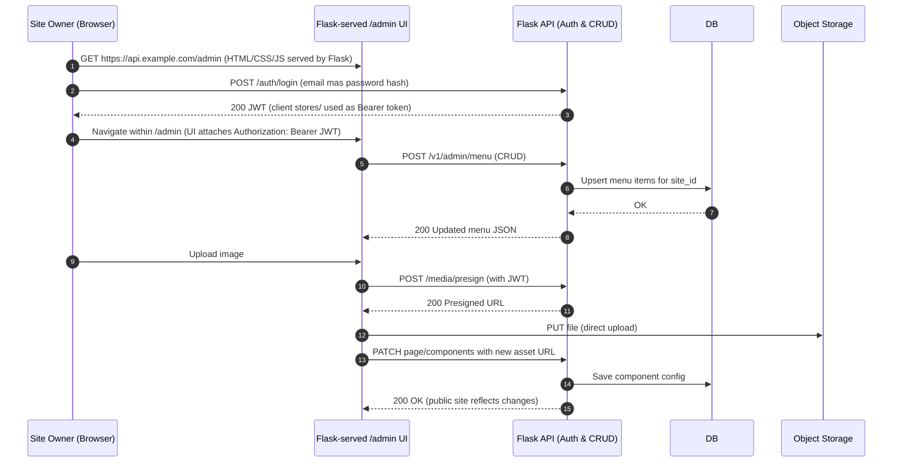

```mermaid
sequenceDiagram
  autonumber
  participant Owner as Site Owner (Browser)
  participant ADM as Flask-served /admin UI
  participant API as Flask API (Auth & CRUD)
  participant DB as DB
  participant S3 as Object Storage

  Owner->>ADM: GET https://api.example.com/admin (HTML/CSS/JS served by Flask)
  Owner->>API: POST /auth/login (email mas password hash)
  API-->>Owner: 200 JWT (client stores/ used as Bearer token)
  Owner->>ADM: Navigate within /admin (UI attaches Authorization: Bearer JWT)
  ADM->>API: POST /v1/admin/menu (CRUD)
  API->>DB: Upsert menu items for site_id
  DB-->>API: OK
  API-->>ADM: 200 Updated menu JSON
  Owner->>ADM: Upload image
  ADM->>API: POST /media/presign (with JWT)
  API-->>ADM: 200 Presigned URL
  ADM->>S3: PUT file (direct upload)
  ADM->>API: PATCH page/components with new asset URL
  API->>DB: Save component config
  API-->>ADM: 200 OK (public site reflects changes)
```
