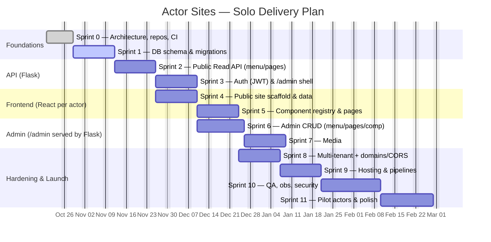

# Roadmap & Sprints — Actor Sites (React + Flask)

> Team size: **1 developer** (solo). Adjusted for realistic solo velocity: \~1.5–2 weeks per sprint. `/admin` is served by Flask; public site is a per-actor static React build.

## Timeline (Gantt)

---

## Sprint 0 — Architecture, repos, CI (1.5 weeks)

**Goals**: define architecture; set up repos and CI.

- Design system diagram and decide folder structure.
- Create repos: `actor-sites-frontend`, `actor-sites-api`.
- CI/CD setup with basic linting, type-checking, build pipeline.
- Define `.env` structure and local Docker setup. **Deliverables**: working local environment; docs; builds pass CI.

## Sprint 1 — DB schema & migrations (1.5 weeks)

**Goals**: define persistence model.

- Create tables: `sites`, `users`, `pages`, `components`, `menu_items`, `media_assets`.
- Seed with demo data for testing.
- Establish ORM (SQLAlchemy or Peewee) and migrations. **Deliverables**: migration scripts; seeded local DB.

## Sprint 2 — Public Read API (Flask) (2 weeks)

**Goals**: serve JSON for public sites.

- Set up Flask with blueprints and configs.
- Endpoints: `GET /v1/sites/:slug/menu` and `GET /v1/sites/:slug/pages/:key`.
- Implement CORS and API key per actor. **Deliverables**: working endpoints returning sample JSON.

## Sprint 3 — Auth (JWT) & /admin shell (2 weeks)

**Goals**: build secure `/admin` UI served by Flask.

- Implement `/auth/login`, `/auth/refresh`, `/auth/logout`.
- Store hashed passwords; manage JWT lifecycle.
- Serve admin bundle from Flask route `/admin`. **Deliverables**: login works; protected routes respond correctly.

## Sprint 4 — React public site scaffold (2 weeks)

**Goals**: per-actor static build pulling data from API.

- Setup React + TypeScript + Vite.
- Add React Router and environment configuration.
- Fetch menu and pages from API. **Deliverables**: actor demo site shows dynamic menu + page.

## Sprint 5 — Component registry & pages (2 weeks)

**Goals**: map backend components to React components.

- Build component registry: Hero, Bio, Gallery, Reels, etc.
- TypeScript interfaces for props and API responses. **Deliverables**: site renders full dynamic content from API JSON.

## Sprint 6 — Admin CRUD (2.5 weeks)

**Goals**: editable content for actors.

- Create admin UI (React, served by Flask) for CRUD operations.
- Manage menus, pages, components.
- Handle authentication headers in all API calls. **Deliverables**: admin can edit and see changes in public site.

## Sprint 7 — Media: presign + uploads (2 weeks)

**Goals**: upload media from admin.

- Implement `POST /media/presign` to S3.
- Frontend direct uploads with presigned URLs.
- Display media from CDN. **Deliverables**: working media upload and display.

## Sprint 8 — Multi-tenant + domains/CORS (2 weeks)

**Goals**: isolate actor data.

- Add per-actor domain config and slug-based routing.
- Enforce tenant separation in queries.
- Add strict domain-based CORS. **Deliverables**: verified data isolation across actors.

## Sprint 9 — Hosting & pipelines (2 weeks)

**Goals**: automate deployment.

- Dockerize Flask API.
- Host API on small VM or ECS.
- Host React builds on Vercel/Netlify. **Deliverables**: staging environment deployed with CI/CD.

## Sprint 10 — QA, observability, security (2–3 weeks)

**Goals**: testing, monitoring, and resilience.

- Unit and integration tests.
- Add logging, error tracking, and backups.
- Secure API endpoints and tokens. **Deliverables**: stable pre-production version.

## Sprint 11 — Pilot actors & polish (2–3 weeks)

**Goals**: production rollout.

- Onboard 1–2 real actors.
- Performance tuning, SEO, and final UX adjustments.
- Document onboarding workflow for future actors. **Deliverables**: two live actor sites; deployment playbook.

---

### Expected Duration

- **Total:** \~5–6 months (solo dev, realistic pace, 11 sprints).
- **MVP:** \~3 months (up to Sprint 6).

### Focus Tips for Solo Work

- Automate repetitive tasks early (DB seeds, deploy scripts).
- Keep tests lightweight but consistent.
- Reuse component templates for actors to scale faster.
- Use one staging environment shared across branches.
- Track progress weekly; close each sprint with a working demo.

